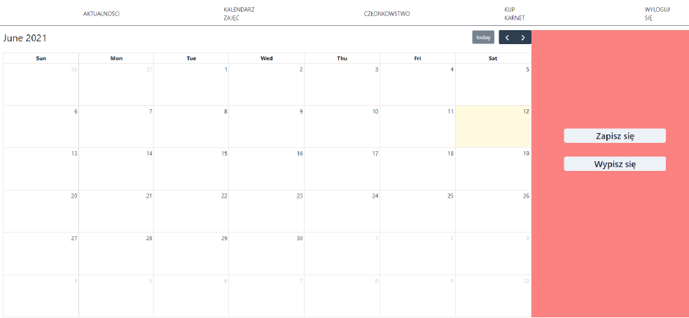

# Gym System
This is my first project created in Spring Boot and React.js.
A system to help gym employees manage their work. 

## Used technologies
Project is created using Spring Boot, MySQL database: 
https://github.com/Kubix007/gym-app-backend .

Frontend was created in React.js with Chakra UI

## Functionality
I constantly add functionality to this website to provide best user experience. So far I added:
  - user authentication created with Spring Security
  - news section
  - calendar with activities (not finished yet)  
  - payment history
  - placing an order for a gym pass
  
## Screenshots

### Main Page

### Login Panel

### Register Panel

### News Section (for users)

### News Section (for administrators)

### Calendar (Activities) Page - not finished yet

### Payment history

### Payment history (for administrators)

### Order Page

  
